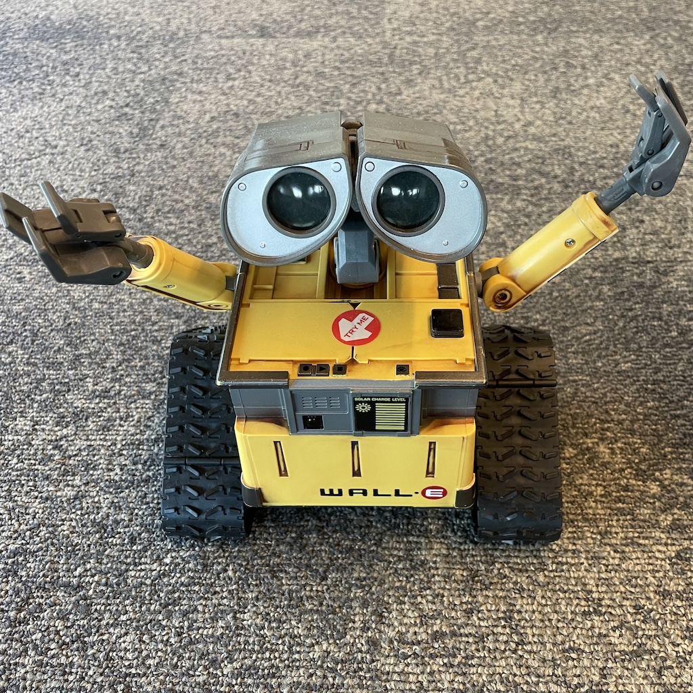

# Wall-E 3.0

Improvement goals over 2.0:
* [x] Use a H-bridge that can provide more voltage hence more torque. In v2, I used an L293D H-bridge IC to drive the DC motors. It turned out it has a pretty high voltage drop. According to the datasheet, the typical motor output voltage is `Vcc - 2.6` and can be as low as `Vcc - 3.6`. I am going to use a MOSFET based H-bridge which would have a much lower voltage drop. I might need to increase the size of the prototype PCB and hence its mount.
* [x] Utilize the "play" mode of the switch. The switch has an off position, and two on positions. One of them is marked as "play" mode. That position connects two additional wires. I can wire one of them to `GND` and another to a GPIO pin, so that I can read from the MCU, thus distinguish the play mode.
* Revise IR remote protocol for better reliability and faster response. In v2, I used a protocol that sends a 32 bit code for each event: button press or joystick coordinate change. The transmission takes 63ms, which means the fastest I can achieve is 15 frames per second. I decided to take a different approach and transmit the state of the gamepad in each frame with 40 bits. The frame rate is still low (actually even lower), but I can transmit the full state of the gamepad in each frame.
* Improve IR remote control for better range. In v2, I drive the IR LED with a GPIO pin, which does not provide enough power. So I'm planning to use a transistor to amplify the signal, and potentially use two LEDs (one wide beam, one normal beam). If the current burst is too much for the batteries to handle and causes the MCU to brown out, we may change the fuses on the Arduino Pro Mini to lower the BOD level.
* [x] Make it possible to change the audio files. In v2, I uploaded the audio files to the audio module's internal flash and soldered it. So it's fixed to UART mode after booting, and the content cannot be 
* [x] Fix the bug where the numbering of the audio files is messed up. Previously, I noticed that the numbering of the audio files did not align with the file names. It turned out that the order has nothing to do with the file names, but is rather dependent on the order of the files in the file system. See [this note](https://github.com/SnijderC/dyplayer?tab=readme-ov-file#important-files-do-not-play-in-order-of-named-sequence). What's the point of naming the files in the specific way then?! I'll try to upload the files individually, from a Windows box.

## Intro

I bought this Wall-E toy made by Thinkway on eBay. Actually I bought a few, all partially broken. The toy is pretty primitive. It can make some basic moves. But the treads cannot be independently controlled. The arms can go up and down a little too, but not independently. The head can turn. The eyes can tilt a little bit. It only has one motor and it's smartly connected to all those parts with a gearbox to make them move in some ways. But in general, there isn't a high degree of maneuverability. It also has a speaker to make some sounds. When new, it came with an IR remote control. None of the units I bought still had it.

My plan is to control it with a microcontroller. The general idea is to gut the internals and replace them with my own parts. The objectives are as follows.

1. Treads can be controlled independently so that they can move forward and backward and at different speeds. This way, the robot can move forward, backward, turn while moving, and spin in place.
1. The arms can lift and lower independently. They only have one degree of freedom. It'd be too complicated to make them do more than that.
1. The head can turn left and right.
1. The eyes can light up. They each have a blue LED inside.
1. The eyebrows can raise and lower, which is done by tilting the eyes around the center.
1. It can play pre-recorded sounds.
1. It can be controlled with remote controls.

The general approach and necessary materials and tools:
1. All the mechanical parts will be 3d printed. I use Fusion 360 for 3d modeling and FlashForge Adventure 3 Lite for printing.
1. The central control unit will be a microcontroller.
1. I will be using Arduino framework to code the mcu.
1. Misc electronic components that will be described in details in this document. All can be found on Amazon or AliExpress.
1. Misc small screws, also found on Amazon or AliExpress.
1. Misc tools such as a soldering station and precision screw drivers and drills.

## Table of Content

The rest of the documentation is organized as follows.

* [Disassembly](disassembly.md)
* Prototyping
  - [Microcontroller](mcu.md)
  - [Controlling arms](arm.md)
  - [Rotating the head](head_rotation.md)
  - [Driving the treads](drivetrain.md)
  - [Driving the eye tilter](eyetilt.md)
  - [Audio](audio.md)
  - [Remote receiver](remote_receiver.md)
* [Remote Control](remote_control.md)
* [RC protocol](remote_protocol.md)
* [Integration](integration.md)
* [Firmware](firmware.md)
* Schematics
  - [Main unit](./schematics/main.svg)
  - [Remote control](./schematics/remote.svg)

* 3D models
  - [Fusion 360 file](./wall-e.f3d)
  - [STL files](./stls/)

## Demo

Here is the demo video (on YouTube) of the final product, controlled by a Roku remote control and my custom remote control. It opens on youtube.

