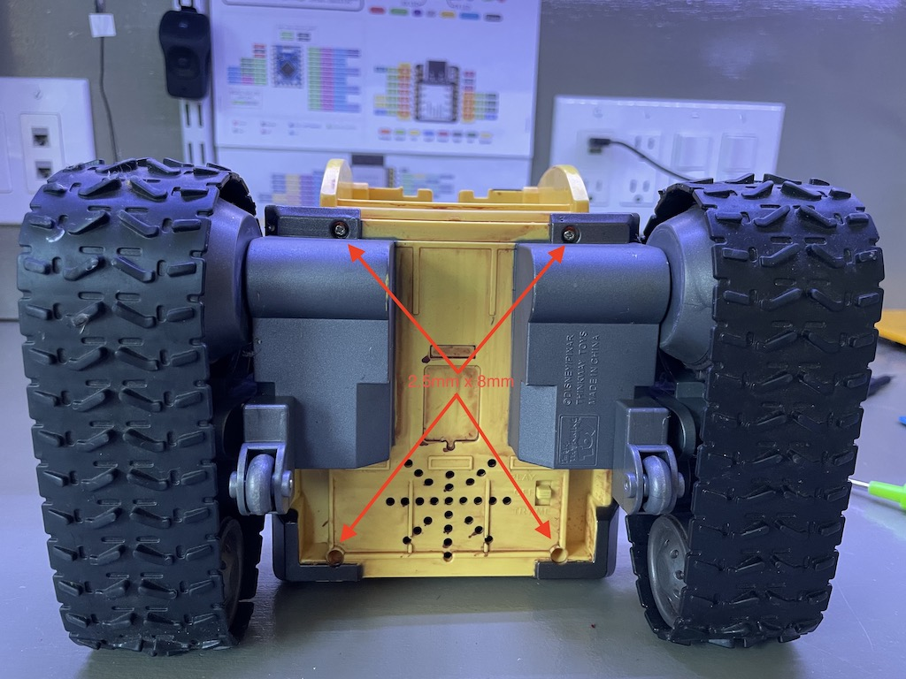
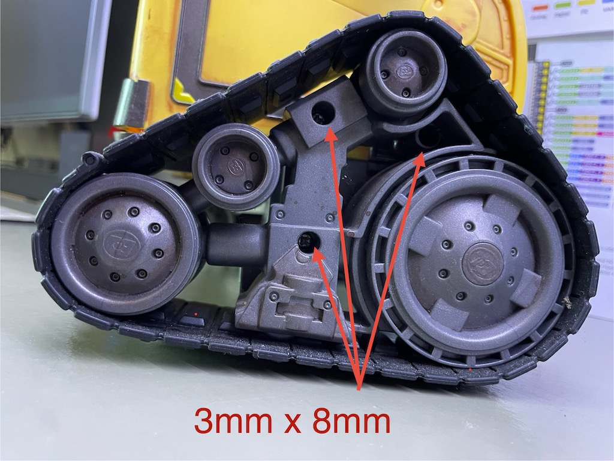
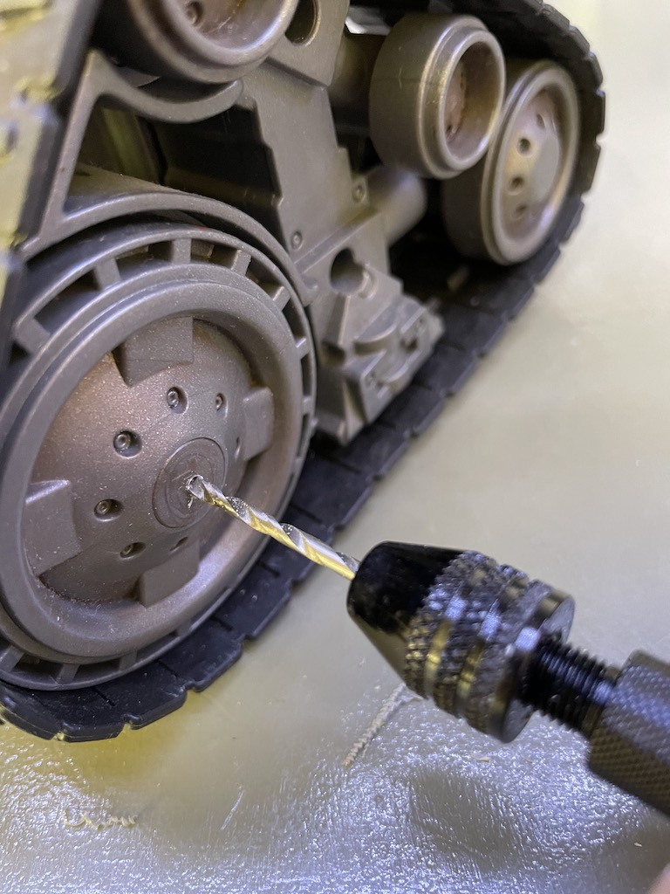
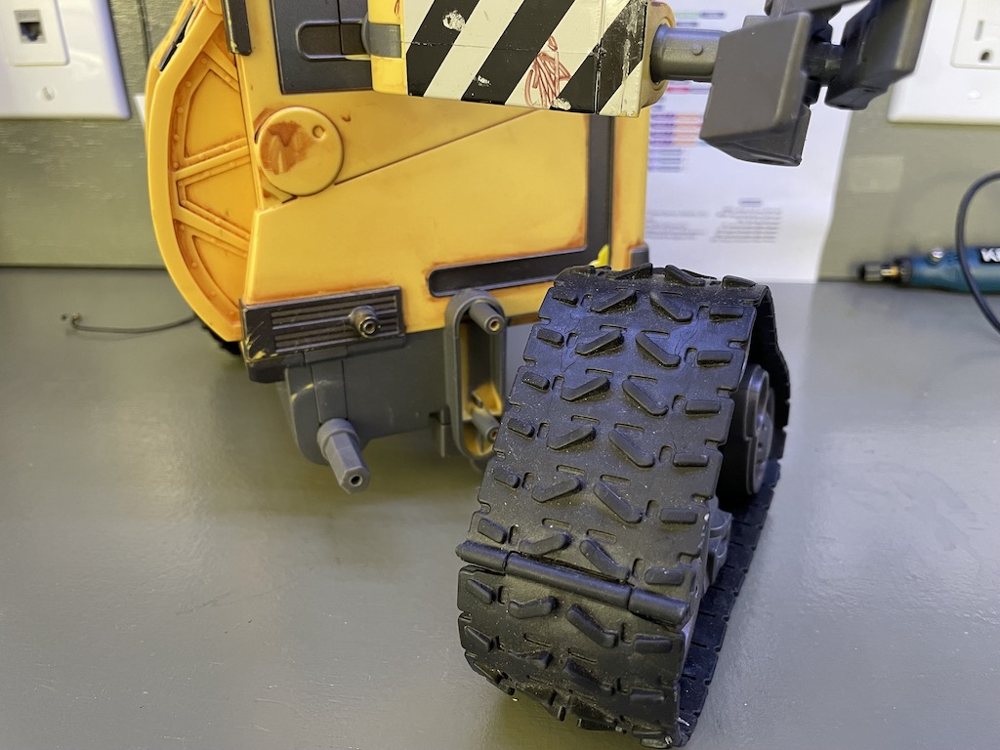
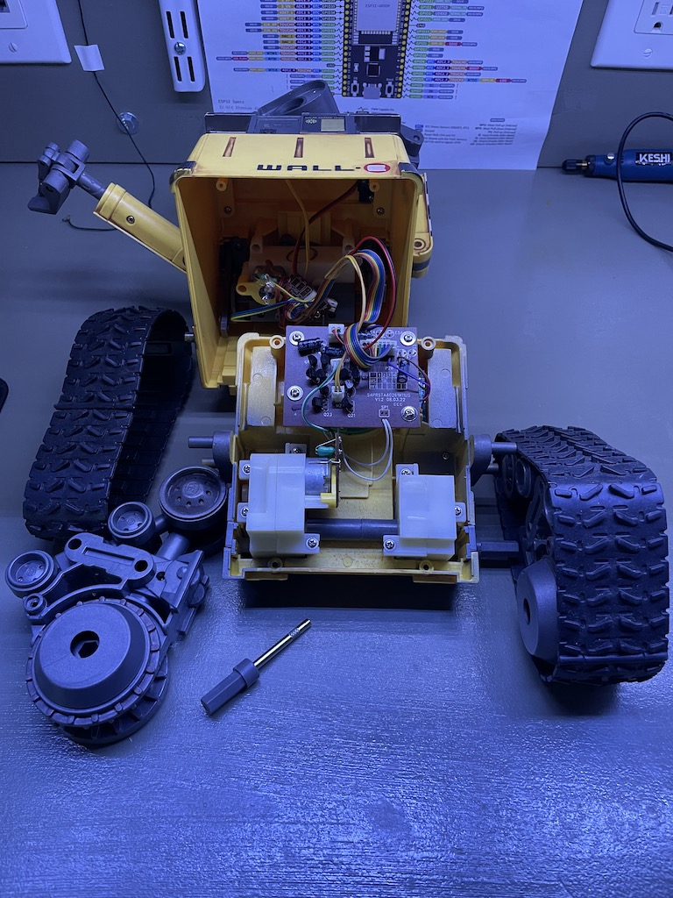
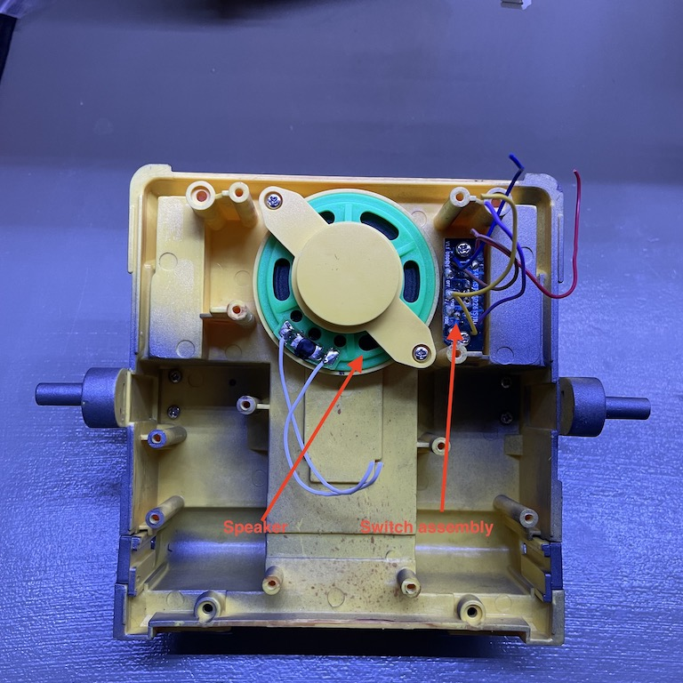
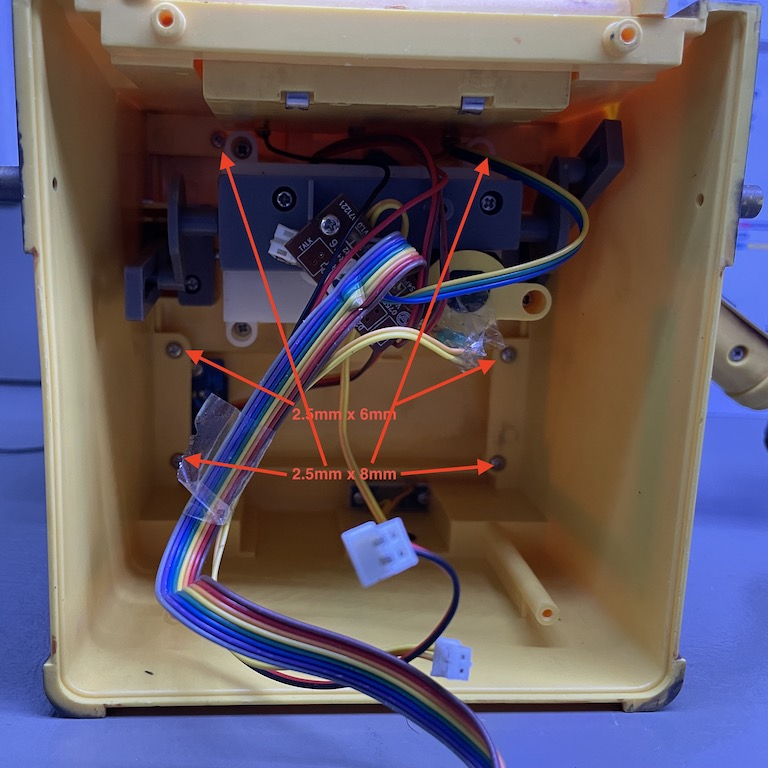
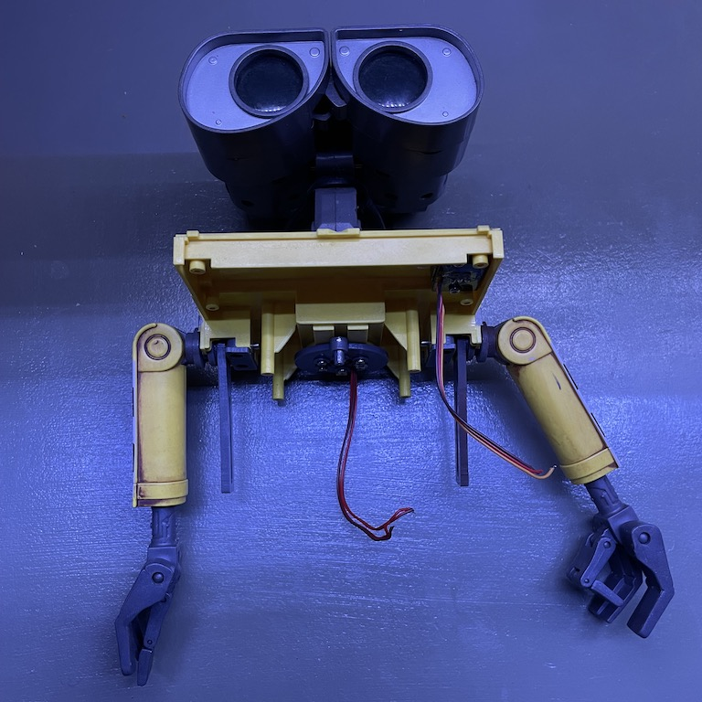
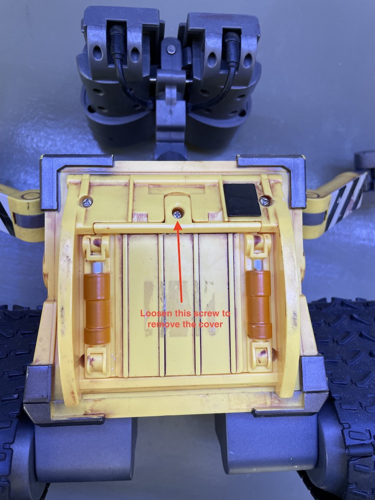
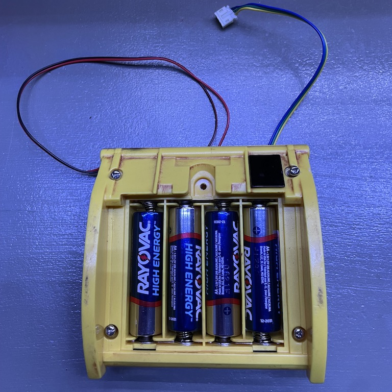

# Wall-E 2.0

I bought this Wall-E toy made by Thinkway on eBay. Actually I bought a few, all partially  broken. It's pretty primitive. It can make some basic moves. But the treads cannot be independently controlled. The arms can go up and down a little too, but not independently. The head can turn. The eyes can tilt a little bit. It also has a speaker to make some sounds. When new, it came with an IR remote control. None of the ones I bought still had it.

My plan is to control it with a microcontroller. I already made a v1 but didn't document the project in details. I am also not happy with a couple of things:

1. The arm movements are too jerky. I suppose it's because the servos are too weak.
1. I used a standalone PWM module which made the electronics a little complicated.

So, here's my attempt at improving and simplifying the design. The general idea is to remove the internals and replace them with my own. The objectives are as follows.

1. Treads can be controlled independently so that it can make all possible movements.
1. The arms can lift and lower independently. They only have one degree of freedom. It'd be too complicated to make them do more than that.
1. The head can turn left and right.
1. The eyes can light up. They each have a blue LED inside.
1. It can play pre-recorded sounds.
1. It can be controlled with a remote control.

## Disassembly

First things first. Let's take it apart. It's rather straight-forward with one caveat, which is the two hidden screws on the drive wheels. It also has a few non-standard screws but workarounds are available.

Remove 4 screws on the bottom

Remove these 3 screws on the side of the tread assembly

Drill a hole to expose the 4th screw

The tread assembly can now be removed.

Repeat for the opposite side. The axle can be a little tight. Pull gently. Once both treads are removed, the bottom can be separated.

Now we can remove the main drivetrain and its control circuit. I am not planning to reuse any of this. But I am keeping the speaker and the switch.

Remove these 6 screws to remove the body to separate the head and shoulder from the body.

Now, remove the screws fastening the drivetrain for the head and arms. The head assembly has four wires for the LEDs inside the eyes. There is an IR sensor for the remote on the shoulder.

To remove battery compartment, first loosen the single screw to remove the back cover and expose four more screws.

These four screws need a special triangle bit that I don't have. But a T7 torx worked fine. I will replace them with normal 2.5x8 screws.

The battery compartment contains the batteries as well as a second IR sensor for the remote control.

Now the main components are separated. To recap, I am going to discard the following and keeping the rest.
* Main drivetrain for the treads.
* Drivetrain for the head and arms.
* Control circuits.

## Prototyping

Let's get started on prototyping! The goal here is to figure out how individual components work on their own, both mechanically and electronically, and to come up with a design.

### Treads

### Head

### Arms

### Eyes

### Audio

### Remote

## Implementation

### Microcontroller

Here's a tally of all the pins.

* PWM output: 10 pins
  - Left tread H bridge (2 pins)
  - Right tread H bridge (2 pins)
  - Left eye LED
  - Right eye LED
  - Left arm servo
  - Right arm servo
  - Head servo
  - Eye tilt motor

* Input: 2 pins
  - IR sensor
  - Push button

