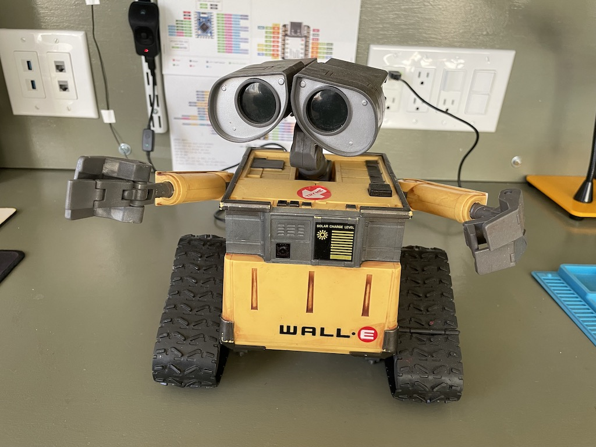

# Wall-E 2.0

I bought this Wall-E toy made by Thinkway on eBay. Actually I bought a few, all partially  broken. It's pretty primitive. It can make some basic moves. But the treads cannot be independently controlled. The arms can go up and down a little too, but not independently. The head can turn. The eyes can tilt a little bit. It also has a speaker to make some sounds. When new, it came with an IR remote control. None of the ones I bought still had it.

My plan is to control it with a microcontroller. I already made a v1 but didn't document the project in details. I am also not happy with a couple of things:

1. The arm movements are too jerky. I suppose it's because the servos are too weak.
1. I used a standalone PWM module which made the electronics a little complicated.

So, here's my attempt at improving and simplifying the design. The general idea is to remove the internals and replace them with my own. The objectives are as follows.

1. Treads can be controlled independently so that it can make all possible movements.
1. The arms can lift and lower independently. They only have one degree of freedom. It'd be too complicated to make them do more than that.
1. The head can turn left and right.
1. The eyes can light up. They each have a blue LED inside.
1. It can play pre-recorded sounds.
1. It can be controlled with a remote control.

## Table of Content

The rest of the documentation is organized as follows.

1. [Disassembly](disassembly.md)
1. [Prototyping](prototyping.md)
