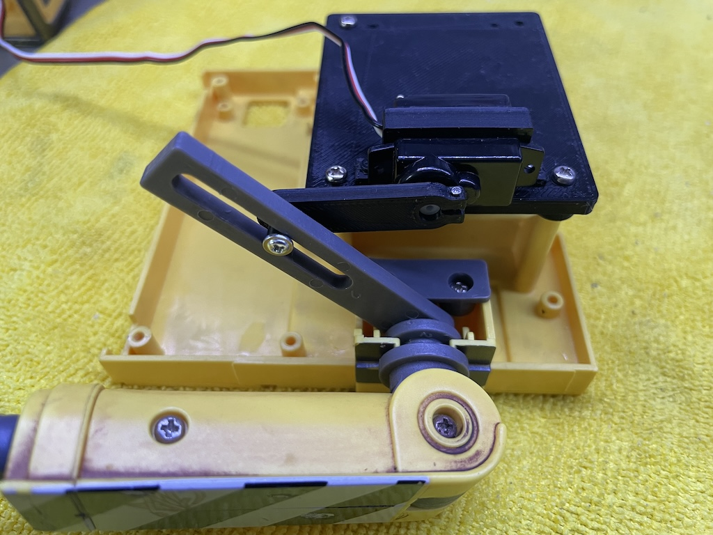

# Controlling arms

I am going to use servos to control the rotation of the arms and the head. Mechanically, the arms pose a small challenge. I can't disassemble the arm assembly any further without risking damaging the plastic. So I can't get to the axles that the arms rotate around. But I came up with a reasonable solution using the existing mechanism, not requiring the servo shaft and the arm axles to be concentric.



I am using a 5g servo WK-P0050 that I bought from [Amazon](https://www.amazon.com/gp/product/B09TKLQ44L). It's not available there anymore but can be found on AliExpress and other sites.

The servo is fixed on the upper platform (./stl/upper_platform_upper_platform.stl) with a clamp ([stl](./stl/arms_clamps_arm_servo_clamp_l.stl)). The crank ([stl](./stl/arms_cranks_arm_servo_crank_l.stl)) is clamped to the servo shaft using an M1 x 5mm screw and a nut. The screw and nut are tiny!

A servo normally rotates 180 degrees. But I don't necessarily need all that range. Its position is controlled with a PWM signal, whose duty cycle width determines the position. Pi Pico's servo library supports specifying the width in microseconds in addition to angles in degrees. So, I am going to map range `[0, 1]` to the minimum and maximum PWM widths, corresponding to the physical range I need for each servo. This way, my code only needs to specify a value between 0 and 1 and the servo will be set to the corresponding position. The details of the servo is abstracted away.

To find out the PWM width ranges, I wrote a [sketch](./servo_calibrate/) which reads a number from the serial console and outputs it to the servo. This way, I can manually enter values to move the servo and find out the minimum and maximum values.

```
#include <Servo.h>

Servo servo;

int min_us = 0;
int max_us = 5000;

void setup() {
  Serial.begin();
  servo.attach(8, min_us, max_us);
  servo.writeMicroseconds(1500);
}

void loop() {
  while (!Serial.available()) {}
  int us = Serial.parseInt();
  Serial.println(us);
  servo.writeMicroseconds(us);
}
```

Next, I wrote a [sketch](./servo_sweep/) to sweep the servo back and forth within the range.

```
#include <Servo.h>

Servo servo;

constexpr int min_us = 540;
constexpr int max_us = 1860;

void setup() {
  servo.attach(8, min_us, max_us);
  Serial.begin(115200);
}

void loop() {
  static int step_us = (max_us - min_us) / 100;
  static int us = min_us;

  servo.writeMicroseconds(us);
  Serial.println(us);
  delay(10);
  us += step_us;
  if (us >= max_us) {
    us = max_us;
    step_us *= -1;
  }
  if (us <= min_us) {
    us = min_us;
    step_us *= -1;
  }
}
```


Sweet! Now onto the servo for the head.
