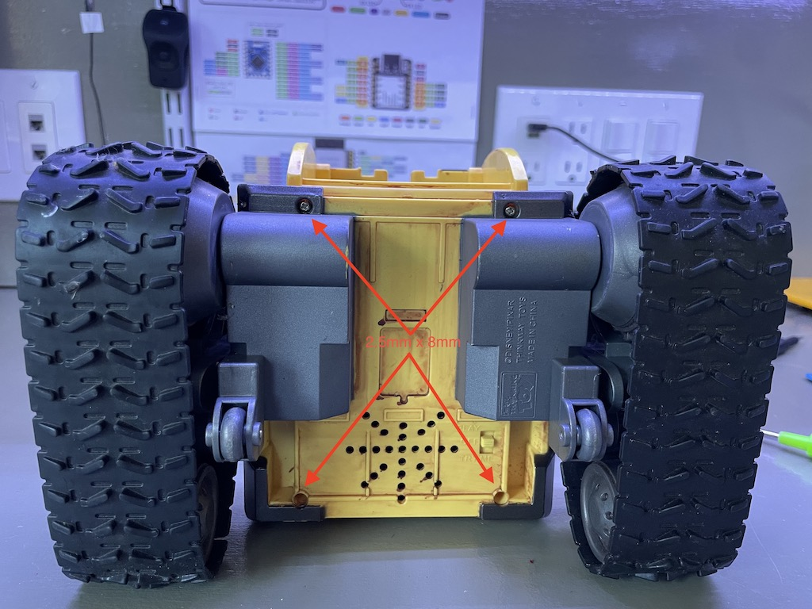
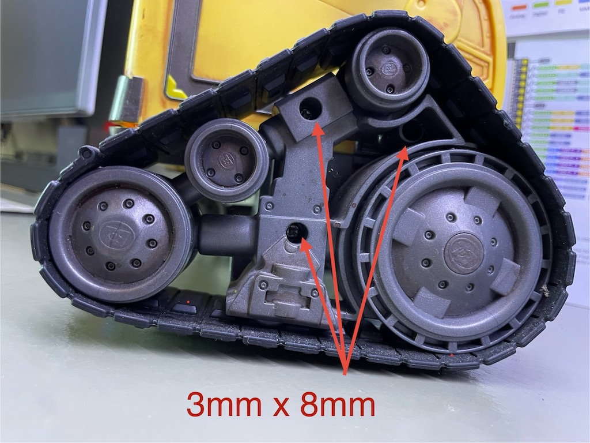
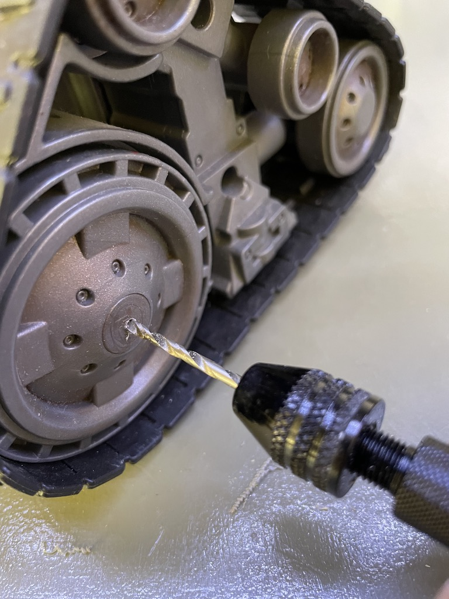
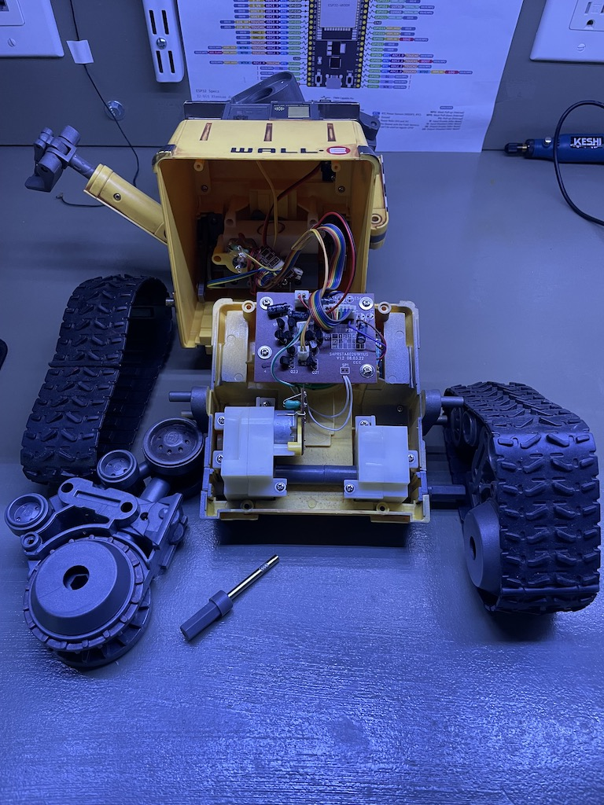
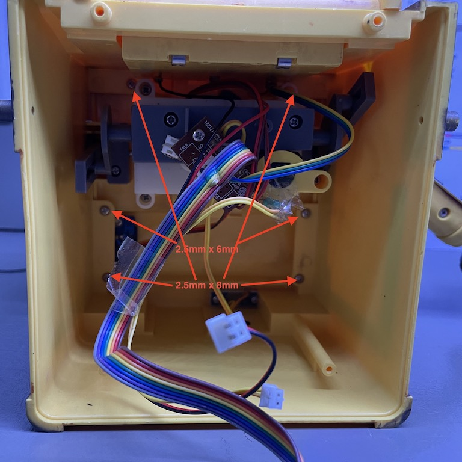
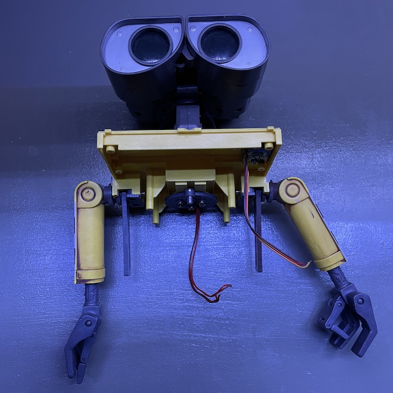
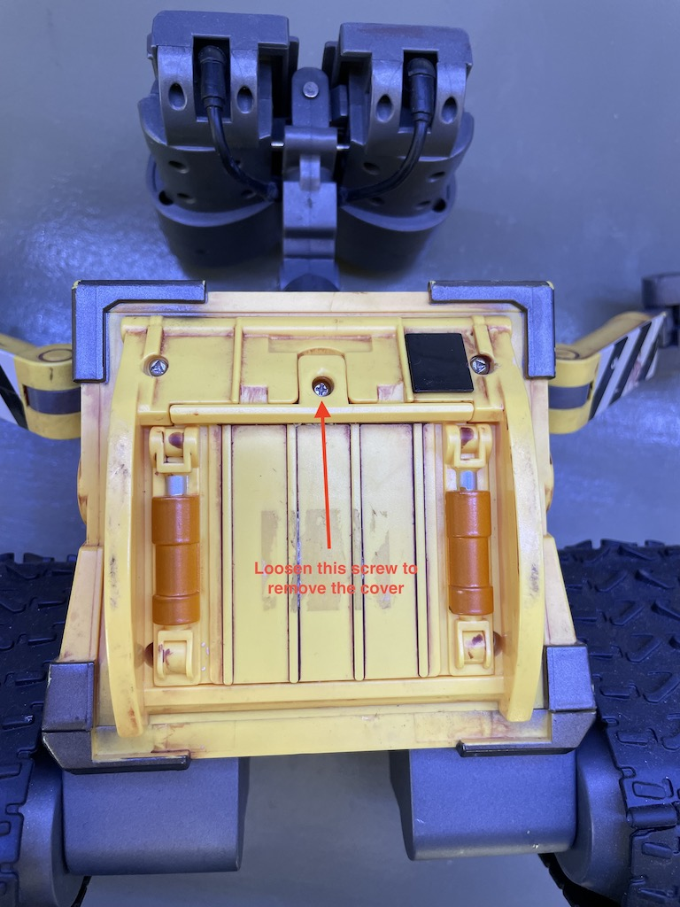
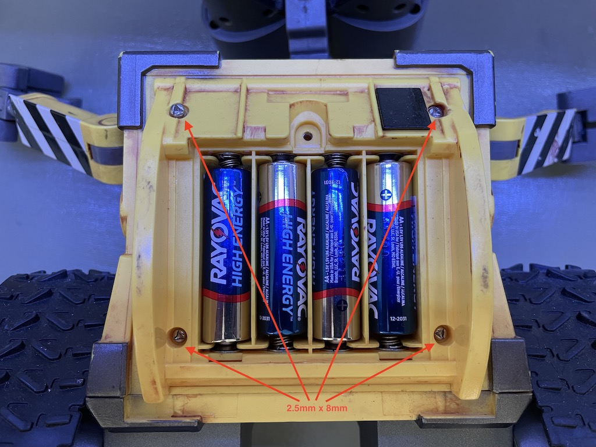
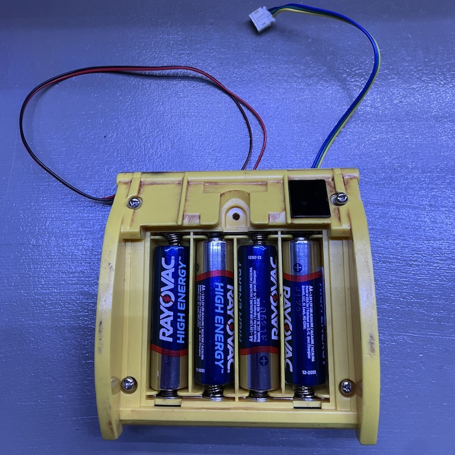

# Disassembly

First things first. Let's take it apart. It's rather straight-forward with one caveat, which is the two hidden screws on the drive wheels. It also has a few non-standard screws but workarounds are available.

Remove 4 screws on the bottom

Remove these 3 screws on the side of the tread assembly

Drill a hole to expose the 4th screw

The tread assembly can now be removed.

Repeat for the opposite side. The axle can be a little tight. Pull gently. Once both treads are removed, the bottom can be separated.

Now we can remove the main drivetrain and its control circuit. I am not planning to reuse any of this. But I am keeping the speaker and the switch.

Remove these 6 screws to separate the head and shoulder from the body.

Now, remove the screws fastening the drivetrain for the head and arms. The head assembly has four wires for the LEDs inside the eyes. There is an IR sensor for the remote on the shoulder.

To remove battery compartment, first loosen the single screw to remove the back cover and expose four more screws.

These four screws need a special triangle bit that I don't have. But a T7 torx worked fine. I will replace them with normal 2.5x8 screws.

The battery compartment contains the batteries as well as a second IR sensor for the remote control.

Now the main components are separated. To recap, I am going to discard the following and keeping the rest.
* Main drivetrain for the treads.
* Drivetrain for the head and arms.
* Control circuits.
