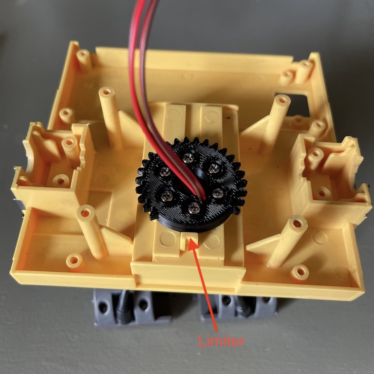
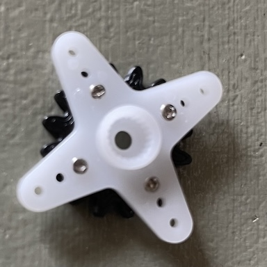
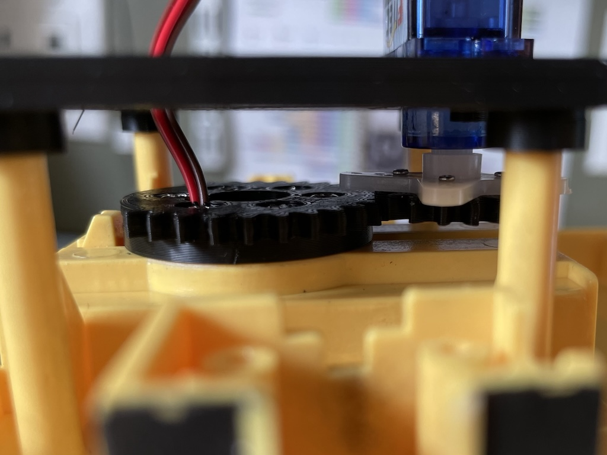

# Rotating the head

Since the head assembly is heavy, I am going to use a stronger 9g servo SG90, a staple servo that comes with any Arduino kit. I am replacing the original plate with a 3d printed gear with mounting holes matching the original holes on the plate. The original plate also has an opening whose either end would hit a limiter when the maximum range is hit. So I have removed some teeth from a full gear to achieve the same function.

Then I attach a 3d printed driving gear to the servo's arm.

The driving and driven gears are then meshed together.

A note on generating the gears: I used the SpurGear add-in in Fusion 360 to generate them and manually customized them. The driving gear has 16 teeth and the the driven gear had 32, 9 of which were removed. The module is 1. I.e. the pitch diameters are 16mm and 32mm for both gears respectively. The backlash is 0.2mm.

Similar to the servos for the arms, I calibrated the range of motion of the servo and tested the sweeping motion of the servo.

