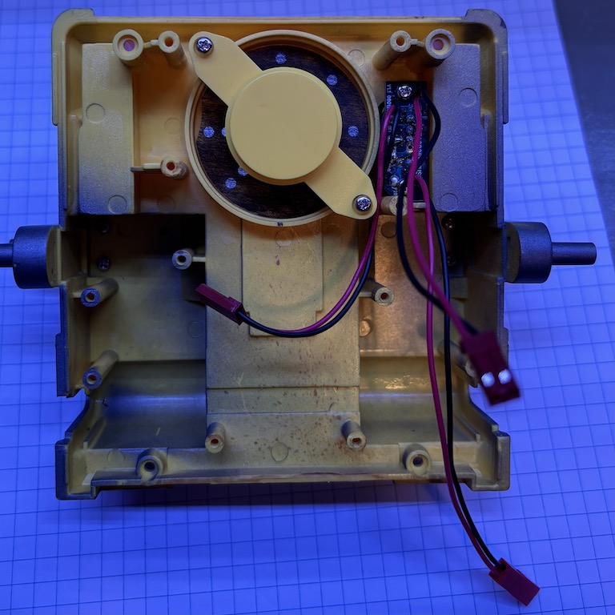
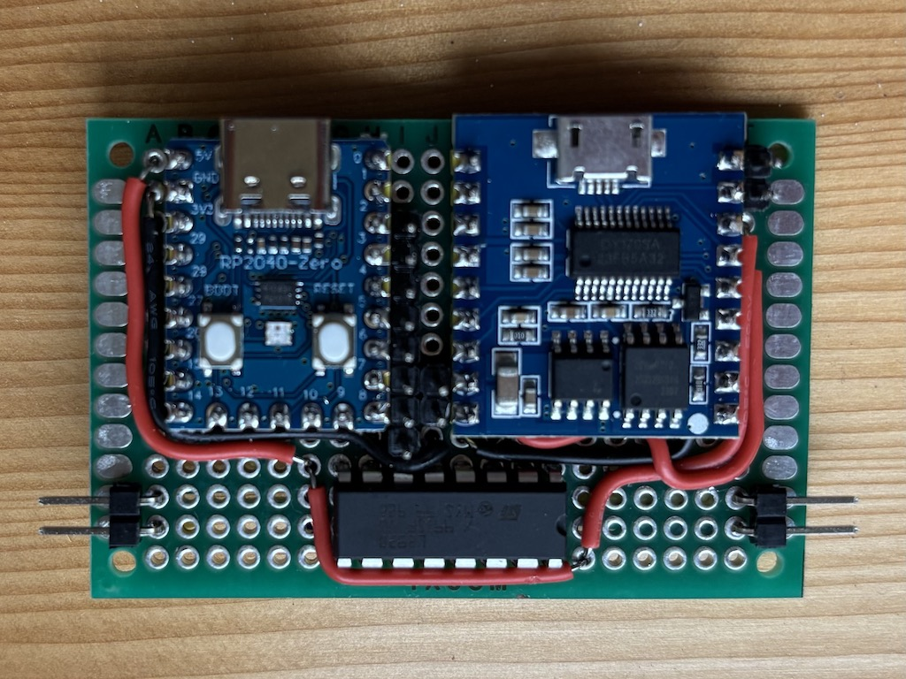
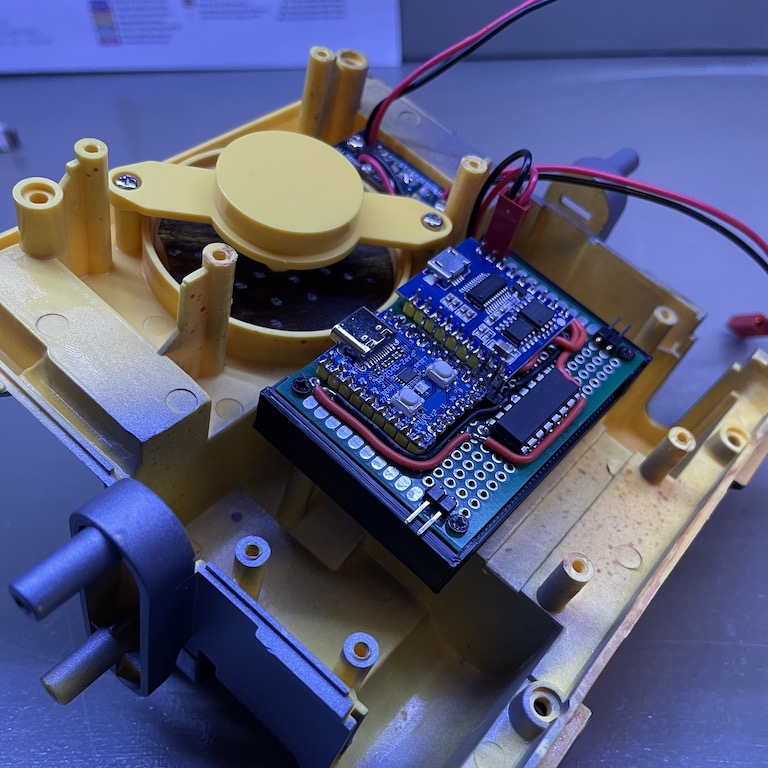
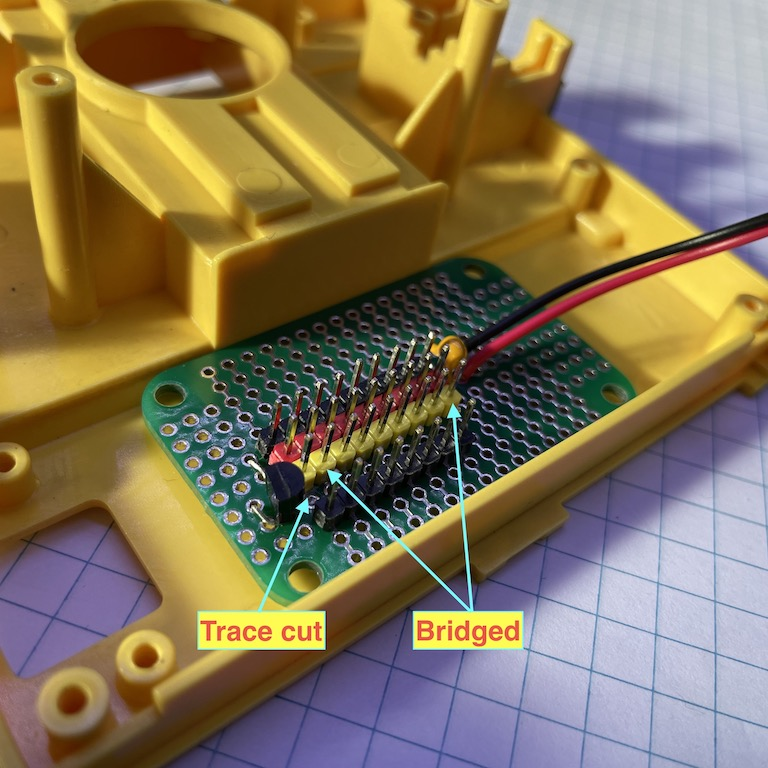

# Integration

## Electronics

I am dividing the electronics into two parts. The lower part is mounted on the chasis near the drive train. It contains the MCU, the audio player, and the H-bridges. The upper part is basically a hub for everything related to the head, arms, IR remote, and the push button. The two parts are connected with a ribbon cable and Dupont connectors.

The power source is first fed to the switch. The switched power is fed to both the upper and the lower parts. The switch is a three way one. In addition to on and off, there is also a "play" mode. In that mode, the brown and purple wires are connected. I could potentially utilize it and read it in the MCU. I am not really sure what to do with the information though. So I am skipping it and keeping it simple. So here's the finished switch, with one input and two outputs. The connectors are 2-pin JST RCYs. The female end can be directly plugged into standard 2.54mm Dupont male connectors. I had to enlarge the exisitng holes on the switch PCB using a small file. Otherwise it's rather trivial to cut existing wires and solder new ones.

I managed to solder everything in the lower part onto a 50mmx70mm perf board. It has the following interfaces:

* Power source
* Left and right motors
* Speaker
* Connectors for the upper part

The PCB is then mounted to the chasis using a 3D printed mount.

Now the upper part. I want to have a neat interface between the upper part and the lower part for easy assembly. So I use a small PCB as a hub and plug everything in the lower part into its pin headers. The PCB has a power bus connected to the switched power source. Then I use a flat ribbon cable to connect all the logic signals. The two IR receivers' signals are combined on the PCB and fed to the MCU via one pin. The MOSFET for the eye tilter motor is also integrated to the PCB. Here are the connections.

1. Eye tilt motor - GPIO 2 
2. IR receiver, front - GPIO 3
3. Eye, right - GPIO 4
4. Eye, left - GPIO 5
5. Head - GPIO 6
6. Arm, left - GPIO 7
7. Arm, right - GPIO 8
8. Push button - GPIO 9
9. IR receiver, back - GPIO 3

<!--  -->

## Mechanics

For the main drive train, I am mounting the DC motors directly the to driving wheels, using 3d printed parts. The motors are connected to the outputs of the H-bridges.

For turning the head and tilting the eyes, I already described the mechanism [here](./head_rotation.md) and [here](./motor.md). The servos for driving the arms are described [here](./arm.md). Altogether, I am mounting the three servos and the DC motor on an upper platform.

## Calibration and debugging

Before working on the final sketch, I am going through the following steps to make sure all parts are functioning as expected.

For the upper part:

1. Verify eye LEDs
1. Verify IR remote receiver
1. Verify eye tilter motor
1. Verify push button
1. Verify arm and head servos
1. Calibrate servos to determine the limits

For the lower part:

1. Verify both DC motors can turn both directions and the speed can be controlled with PWM pins

To interact with the MCU after everything is mounted and connected, I made a USB-C cable without the +5V wire. This way, I can power everything with an external power source instead of the computer's USB hub. Instead of connecting the power input to the battery case, I leave the battery case unassembled and power it with a bench power. This way, I can leave the back open for easier debugging.
