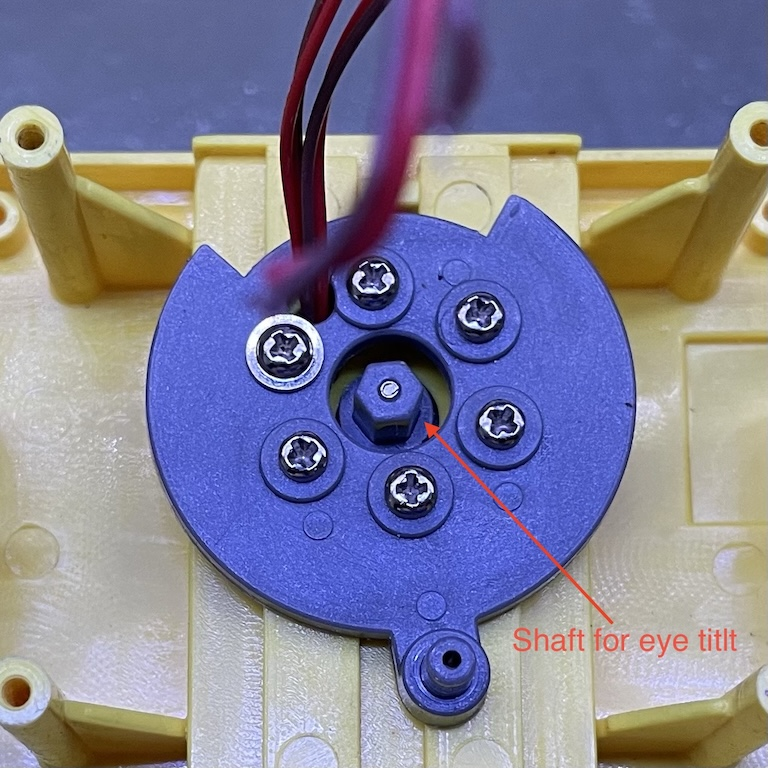

# Driving one-direction motors

The eye tilt is controlled with a single shaft rotating either direction. The shaft is directly connected to a N10 DC motor. There's no need for an H-bridge since we only need one direction. Instead, we need be able to turn it on and off with a MOSFET. We could use a PWM pin to control the speed but that's really unnecessary. We only need one speed.



First I connected the motor directly to a 5V power supply and measured about 50 mA of current. So a 2N7000 MOSFET should be good enough to drive it. So I made a quick breadboard prototype and loaded a [sketch](./motor_unidirectional/) to run the motor 3 seconds on and 1 second off repeatedly. It works perfectly.

```
void setup() {
  pinMode(14, OUTPUT);
}

void loop() {
  digitalWrite(14, HIGH);
  delay(3000);
  digitalWrite(14, LOW);
  delay(1000);
}
```

