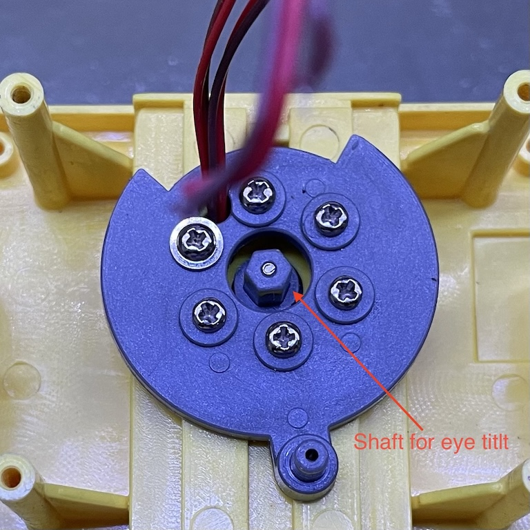

# Prototyping

Let's get started on prototyping! The goal here is to figure out how individual components work on their own, both mechanically and electronically, and to come up with a design.

## Microcontroller

We need to choose a microcontroller. I am not going to make a custom PCB for this project. Instead, I will use a dev board and a perf board. There are a few factors to consider.

1. There needs to be enough pins.
1. Dimension. We want the board to be compact.
1. Power. Ideally, I want to be able to power the board with 4 AA batteries, so that I don't need an extra 5V DC regulator.

Here's a tally of all the pins.

* PWM output: 7 pins
  - Left tread H bridge (2 pins)
  - Right tread H bridge (2 pins)
  - Left eye LED
  - Right eye LED
  - Eye tilt motor

* Servos: 3 pins. Generally, libraries use PWM to control servos. Some may use PIO on Pi Pico.
  - Left arm servo
  - Right arm servo
  - Head servo

* Input: 2 pins
  - IR sensor
  - Push button

* UART for audio: 2 pins. Not all pins can be used for UART.
  - Rx
  - Tx

I have a few [RP2040-Zero dev boards](https://www.waveshare.com/rp2040-zero.htm) in my drawer. They are compatible with Raspberry Pi Pico but has a much smaller footprint.

* Dimensions: 18 x 23.5
* Regulator: ME6217 (LDO, 800mA, max input 6.5V)
* GPIOs: 20 via the header, all capable of PWM.
* UART: 2; UART0 defauts to GPIO0(Tx) and GPIO1(Rx).

It seems to fit the bill really well. 

### Dimming LEDs

Let's verify that all the GPIO pins are PWM capable by using a simple sketch to dim LEDs.

```
int pins[] = {0, 1, 2, 3, 4, 5, 6, 7, 8, 9, 10, 11, 12, 13, 14, 15, 26, 27, 28, 29};

void setup() {
  for (int i = 0; i < sizeof(pins) / sizeof(pins[0]); i ++) {
    pinMode(pins[i], OUTPUT);
  }
}

void loop() {
  static int brightness = 0;
  static int fadeAmount = 5;
  
  for (int i = 0; i < sizeof(pins) / sizeof(pins[0]); i ++) {
    analogWrite(pins[i], brightness);
  }

  brightness += fadeAmount;

  if (brightness <= 0 || brightness >= 255) {
    fadeAmount = -fadeAmount;
  }

  delay(30);
}
```

Sure enough, all these 20 pins are able to fade the LED. These pins should be good for controlling motors and servos as well. But let's verify on a breadboard, especially servos.

### Driving motors with H-bridges

The main motors need to be able to rotate both directions and the speed needs to be controlled. So we'll use two H-bridges, each with two PWM pins.

### Driving one-direction motors

The eye tilt is controlled with a single shaft rotating either direction. So there's no need for an H-bridge. Instead, we should be able to control its speed by using a MOSFET and a PWM pin.



### Driving servos

## Audio

I used a [DFPlayer](https://www.dfrobot.com/product-1121.html) in the first version and thought it was a bit expensive (~$20 at the time). But the price seems to have come down quite a bit. AliExpress even has some clones that costs only $1 a piece. It doesn't have internal flash. Instead, it reads from microSD cards. I have quite a few of microSD cards salvaged from all sorts of electronics found in e-waste bins.

So, let's see if it plays nicely with the RP2040-Zero.

## Mechanics

### Treads

### Head

### Arms

### Eyes

## IR Remote Control

The original toy came with a remote control but none of mine had it when I bought them. Not that I really want to use it though. Instead, I want to be able to use an existing TV remote control and make my own. Wall-E has two IR sensors, one on the shoulder and one on the back. I can either reuse them if they work or replace them with my own if needed.

First order of business is to verify that the sensors respond my IR emitter and TV remotes.
