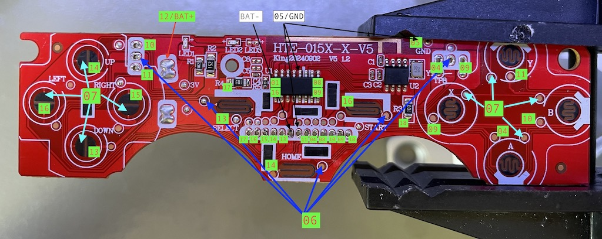
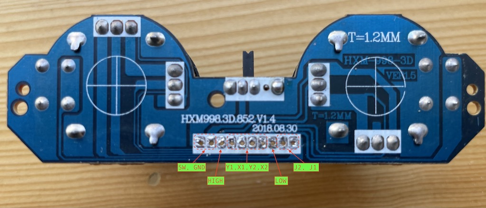
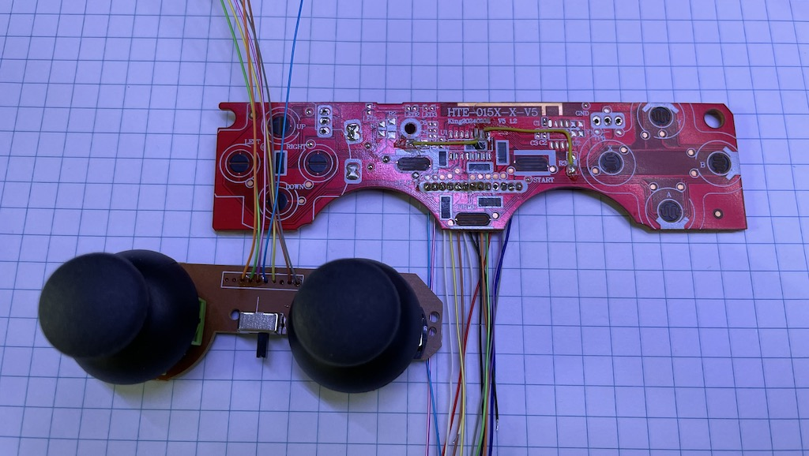
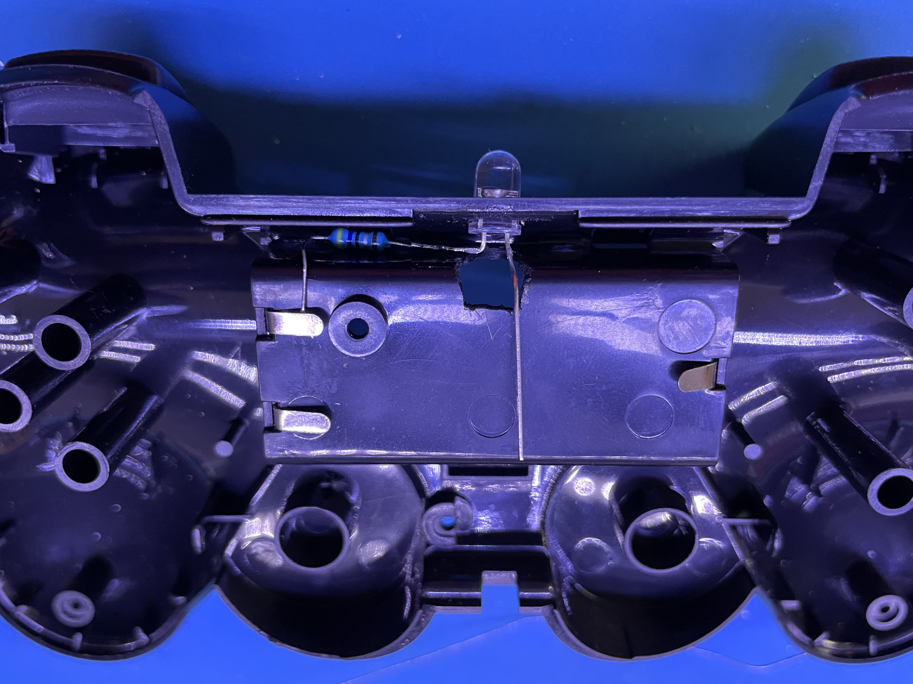
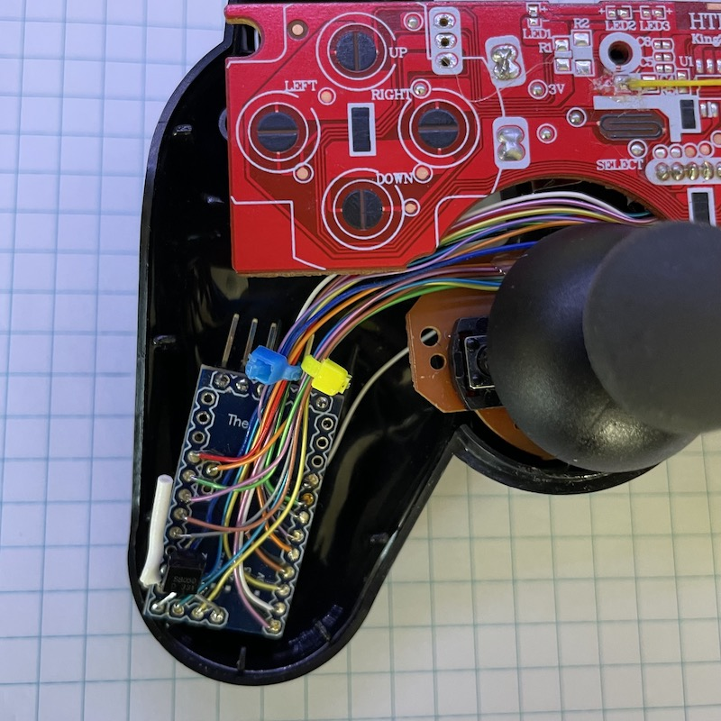
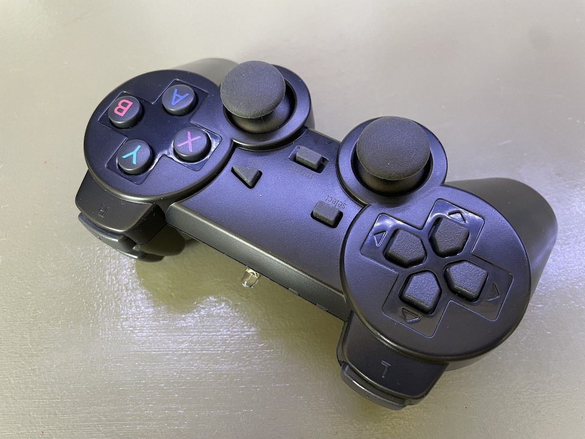

# Custom Remote Control

In addition to using an existing remote control, I also wanted to make my own remote control with joysticks. The biggest challenge is probably 3d printing the housing. So I am exploring the option of using an existing wireless PS2 control bought on AliExpress, gutting the insides and replacing it with a microcontroller and adding a IR LED.

To do that, there are a few things I need to figure out.

1. The joysticks. A PS2 controller has two of them. They are both 2-axis joysticks. I assume they are resistive (i.e. potentiometers) and I should be able to use an ADC pin to read the position of an axis.
1. The IR emitter. This should be relatively easy. The library I use on the receiver side is also capable of sending.
1. The microcontroller. The PS2 controller is powered by 2 AAA batteries, I want to be able to reuse the power source. So I need an mcu that can be powered at 3V. First thing that came to my mind is ATmega 328. I have a couple of them and they are 8MHz versions.

## Microcontroller
As mentioned before, I intend to use an 8MHz ATmega328 dev board (Arduino Pro Mini clones), which should be able to run at 3V comfortably. So I am going to prototype everything on that board. One small caveat about working with this board is that ATmega328 comes in two versions: 8Mhz and 16MHz. When programming with Arduino IDE or CLI, we need to choose the correct frequency. Otherwise, the code will still run, but the timing is all messed up. Anything that relies on the frequency will not work properly. E.g. the serial console or the IR transmitter.

## Range
In v2, one issue I encountered was that the range of the remote control was poor. It turned out that these IR LEDs are designed to endure very high peak current, up to a few hundred mA, which GPIO pins cannot provide. So in v3, I am using a BJT to amplify the signal. In addition, I am putting two LEDs in series, one regular (TSAL6200) and one wide beam version (TSAL6400).

To test the range, I devised an easy tester. On the [sender side](./debug/irrange_sender/), I repeatedly send the same code. On the [receiver side](./debug/irrange_receiver/), I check and verify the code repeatedly. If the code is not received within a timeframe, I light up a red LED. If the error is incorrect, I light up a yellow LED. Then I can walk around the room and test how far I can walk from the receiver and it still remains green.

It turned out that with two LEDs in series, I can reach a range of at least 6-7 meters on my testing apparatus. In practice, since the IR receiver is behind a brown window, the reception is weakened and blocked. But it still works well within 3-4 meters. Not too bad.

### Power saving
The MCU itself can be powered by 1.8-5.5V DC. And since I'm using batteries, I don't need the regulator. Removing it will increase the battery life and eliminate the voltage drop. I connect the battery power directly to the `Vcc` pin. The power indicator LED can be removed too.

## Controller Wiring
I got a couple of different wireless gamepad controllers from AliExpress and disassembled them. They both have tow major PCBs. PCB1, the main PCB, contains the battery box, the IC and various buttons. PCB2 contains two joysticks and a switch. Long story short, this particular one's main PCB has everything I need and needs minimum modification. However, it turned out its joysticks are digital, not analog. On the other hand, the other controller's joysticks are analog and the PCB has the same dimensions. So I created a Frankenstein controller from both of them.

PCB1 contains:
* Left thumb: `L`, `R`, `U`, `D`
* Right thumb: `A`, `B`, `X`, `Y`
* Left index finger: `L1` & `L2`
* Right index finger: `R1` & `R2`
* Middle section: `Select`, `Mode`, `Start`
* A main IC, a transmission IC, and some passive components

I have no use for the components. So let's heat up the PCB with a heat gun and remove everything. I suspected all those buttons would be connected to the main IC in some way, forming a matrix. So I traced the PCB traces and determined the following connections.

|           | col 1 | col 2 | col 3 | col 4 | col 5 | col 6 | col 7 | col 8 |
|-----------|-------|-------|-------|-------|-------|-------|-------|-------|
| **row 1** |  `R1` |  `R2` |  `L1` |  `R2` | `SEL` |`MODE` |       |`START`|
| **row 2** |  `A`  |  `X`  |  `B`  |  `Y`  |  `D`  |  `U`  |  `R`  |  `L`  |

And the pins for the rows and columns:  
```
row 1: pin06  
row 2: pin07  
col 1: pin04  
col 2: pin09  
col 3: pin10  
col 4: pin11  
col 5: pin13  
col 6: pin14  
col 7: pin15  
col 8: pin16  
```



We will need these outgoing wires: 
* to PCB2: `BAT-`, `GND`
* to MCU: `BAT+`, `GND`, `Rows 1-2`, `Cols 1-8`

I did bridged a couple of pads on the PCB so that all wires except `BAT+` can go out from the holes in the center.

PCB2 contains:
* Joystick 1, with axes `X1`, `Y1`, and button `J1`
* Joystick 2, with axes `X2`, `Y2`, and button `J2`
* A sliding switch `SW`

When turned on, the switch shorts its pin to `GND`. The two buttons also shorts their pins to `GND` when pressed. The joysticks are analog. Each axis is a potentiometer. It has a high and a low inputs. The output is the wiper. I'll short the low to `GND` and connect the high to a GPIO.



Here's the plan for connections:
* Short `LOW` with `GND`
* Connect `SW` to `BAT-` from PCB1
* Connect `GND` to `GND` from PCB1, which ultimately connects to `GND` of the MCU

This way, when the switch is turned on, `BAT-` is connected to `GND` of both PCBs and the MCU. 

Outgoing wires:
* to PCB1: `BAT-`, `GND`
* to MCU: `HIGH`, `X1`, `Y1`, `X2`, `Y2`, `J1`, `J2`

For the analog joysticks, we feed a high to `HIGH`, and read the positions from `X1`, `Y1`, `X2`, `Y2`. I could connect `HIGH` to `Vcc`. But I want to pull it high only when I'm reading the values. This will save a little battery, at the cost of using an extra pin. Now to tally all the GPIO pin usage, we need to use 17 input pins, 4 of which need to be able to analog. Note that `A6` and `A7` are analog input only for Pro Mini. So I'll use them for a joystick. Pin `13` is the built-in LED. I could remove the LED and reclaim the pin. But I might find a use for it later. So I'm saving pin `13`. We also need one digital output pin to drive the IR LED. That's 18 GPIO pins in total. The dev board I have, basically a clone of Arduino Pro Mini, has just enough.

PCB1 ↔ MCU:
* `BAT+` ↔ `Vcc`
* `GND` ↔ `GND`
* `Rows 1-2` ↔ `11`, `12`
* `Cols 1-8` ↔ `2` - `9`

PCB2 ↔ MCU:
* `HIGH`: `A5`
* `X1`, `Y1`, `X2`, `Y2` ↔ `A2`, `A3`, `A6`, `A7`
* `J1`, `J2` ↔ `A0`, `A1`

And,
* IR LED: `10`.

After some soldering and hot gluing, here are the PCBs with outgoing wires.


And after some drilling and cutting, I've placed the IR LED on the shell, with the resistor soldered to it and `BAT+`.


Next, let's solder the wires to the dev board.



And voila! We have a custom remote control. After playing with it a little bit, I realized that without a power indicator, it's easy to forget to turn it off. Next time, I'll leave the power LED on the PCB.



