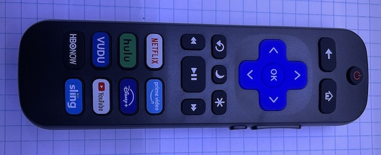

# IR Remote Receiver

The original toy came with a remote control but none of mine had it when I bought them. Not that I really want to use it. Instead, I want to be able to use an existing remote control. In addition, I want to make my own. Wall-E has two IR sensors, one on the shoulder and one on the back. I can either reuse them if they work or replace them with my own if needed.

First order of business is to verify that the sensors responds to my remote control. I have collected some remote controls from e-waste bins in the past. It's time to put them to good use. You probably have figured out by now that dumpster diving is one of my hobbies. Different manufacturers have different IR remote protocols. Many are either publicly available or has been reverse engineered. Here's a very [comprehensive tutorial](https://dronebotworkshop.com/ir-remotes) on this topic. To decode the signals, I am going to use this [Arduino-IRremote library](https://github.com/Arduino-IRremote/Arduino-IRremote). There are some other libraries available for Arduino.

First, I wired up a receiver and checked the waveform with an oscilloscope.


Next, I loaded a simple [sketch](./debug/irreceiver_print/) to print out the raw data. I'm getting something like this on the serial console:

```
Protocol: 10 Raw code: 3759747205
Protocol: 10 Raw Code: 0
```

The particular remote I want to use is a Roku remote. It seems to use NEC and NEC2 protocols. All repeats are NEC2 and all initial presses are NEC. I don't need or want repeats. So I'll just decode NEC (8). Here's the list of the codes for all the buttons, which will be used in the decoding logic.



* Power: 3893872618
* Back: 2573649898
* Home: 4228106218
* Up: 3860449258
* Left: 3776890858
* OK: 3576350698
* Right: 3526215658
* Down: 3425945578
* Repeat: 2272839658
* Sleep: 2640496618
* Star: 2657208298
* Rewind: 3409233898
* Pause: 3008153578
* F. Fwd: 2857748458
* Netflix: 2907883498
* Amazon: 3024865258
* Hulu: 2991441898
* Disney: 4077701098
* Vudu: 4144547818
* YouTube: 2841036778
* HBO: 2974730218
* Sling: 4177971178
* Vol Up: 4027566058
* Vol Down: 4010854378
* Mute: 3743467498

A couple of notes:
* It looks like the receivers have no problem with 6V DC. So I am going to connect them directly to the power source.
* Putting two receivers in parallel doesn't seem to cause any problems. So that's what I am going to do.

I also want to be able to make my own joystick IR remote control. To do that, I can either devise my own protocol, since I have full control on both sides, or piggyback on an existing one, as long as it's capable of encoding all the info I need. The IR library I use is capable of both decoding and encoding.
