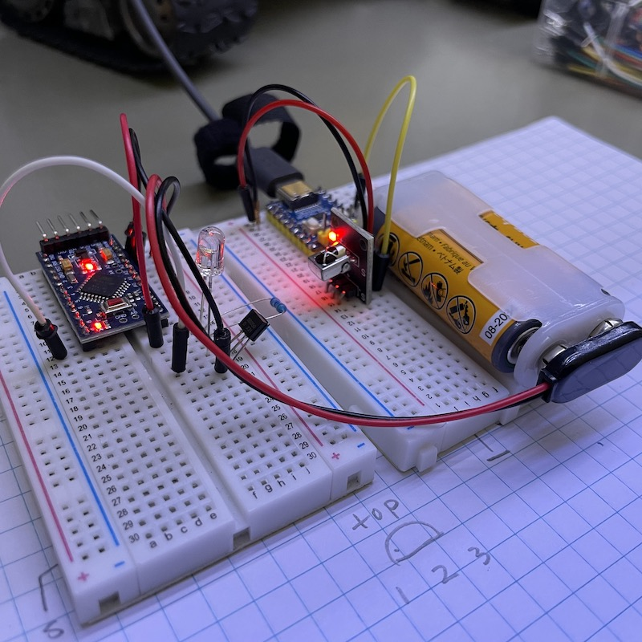

# Custom Remote Control

In addition to using an existing remote control, I also wanted to make my own remote control with joysticks. The biggest challenge is probably 3d pringing the housing. So I am exploring the option of using an existing PS/2 control, gutting the insides and replacing it with a microcontroller.

To do that, there are a few things I need to figure out.

1. The joysticks. A PS/2 controller has two of them. They are both 2-axle joysticks. I assume they are resistive (i.e. pototiometers) and I should be able to use an ADC pin to read the position of an axle.
1. The IR emitter. This should be relatively easy. The library I use on the receiver side is also capable of sending.
1. The microcontroller. The PS/2 controller is powered by 2 AAA batteries, I want to be able to reuse the power source. So I need an mcu that can be powered at 3V. First thing that came to my mind is ATmega 328. I have a couple of them and they are 8MHz versions.

## Microcontroller
As mentioned before, I intend to use an 8MHz ATmega328 devboard (Arduino Pro Mini clones), which should be able to run at 3V comofortably. So I am going to prototype everything on that board. One small caveat about working with this board is that ATmega328 comes in two versions: 8Mhz and 16MHz. When programming with Arduino IDE or CLI, we need to choose the correct frequency. Otherwise, the code will still run, but the timing is all messed up. Anything that relies on the frequency will not work properly. E.g. the serial console or the IR transmitter.

## IR transmitter
I have some generic 940 nm IR LEDs from Amazon and I intend to use one. I can probably control it directly using an MCU pin. But amplifying with a BJT will definitely improve the range.

So my first step is to make sure the MCU and the IR transmitter are capable of running on a 3V DC power supply. So I loaded up a simple sketch to send a code every half a second:

```
#include <IRremote.hpp>

void setup() {
  IrSender.begin(9);
}

void loop() {
  IrSender.sendNECRaw(0x2A);
  delay(500);
}
```

On the receiver side, I read the code from an IR receiver and dump the code:

```
#include <IRremote.hpp>

void setup() {
  Serial.begin(115200);
  IrReceiver.begin(3, false);
}

void loop() {
  if (IrReceiver.decode()) {
    uint32_t code = IrReceiver.decodedIRData.decodedRawData;
    decode_type_t protocol = IrReceiver.decodedIRData.protocol;
    Serial.print("Protocol: ");
    Serial.println(protocol);
    Serial.print("Code: ");
    Serial.println(code);
    IrReceiver.resume();
  }
}
```

Note that `sendNECRaw()` sends codes of protocol `10(ONKYO)`. And the raw code is 16 bits, which is more than enough to encode joystick positions and key presses.



### Power saving
The MCU itself can be powered by 1.8-5.5V DC. And since I'm using batteries, I don't need the regulator. Removing it will increase the battery life and eliminate the voltage drop. The power indicator LED can be removed too.

## Controller Wiring

The PS2 controller has tow major PCBs. PCB1 contains the battery box, the IC and various buttons. PCB2 contains two joysticks and a switch. Here's a list of the controls.

* Arrows group A on the left. Let's denote them as `AL`, `AU`, `AR`, and `AD`
* Arrows group B on the right. Let's denote them as `BL`, `BU`, `BR`, and `BD`
* Buttons `L1` & `L2`
* Buttons `R1` & `R2`
* Buttons `Select`, `Mode`, `Start`
* Joystick 1, with 2 axles and a button `J1`
* Joystick 2, with 2 axles and a button `J2`

`L1`, `L2`, and arrows `Ax` share a common pin. These six buttons have seven pins.
`R1`, `R2`, and arrows `Bx` share a common pin. These six buttons have seven pins.
`Select`, `Mode`, and `Start` are all connected to GND.

Plan:

* Wire `Ax`, `Bx`, `Lx`, and `Rx` as a 2x6 matrix (8 pins) like this:

  |           | col 1 | col 2 | col 3 | col 4 | col 5 | col 6 |
  |-----------|-------|-------|-------|-------|-------|-------|
  | **row 1** |  `AL` |  `AU` |  `AR` |  `AD` |  `L1` |  `L2` |
  | **row 2** |  `BL` |  `BU` |  `BR` |  `BD` |  `R2` |  `R2` |

* All other buttons each uses a separate pin: `Select`, `Mode`, `Start`, `J1`, `J2` (5 pins)
* Wire joystick axles to analog pins (4 pins)

Therefore, we need to bridge:

* `Ax` with `Bx`, for `x` in `{U,D,L,R}`
* `Lx` with `Rx`, for `x` in `{1,2}`

All told, we need to use 17 GPIO pins, 4 of which need to be able to read analog signals. Note that `A6` and `A7` are analog input only. So I'll use them for a joystick. Pin `13` is the built-in LED. I could remove the LED and reclaim the pin. But I might find a use for it later. So I'm saving pin `13`.

Outgoing wires: 
* PCB1: 
  - `BAT-`, `GND`, `BAT+` (to PCB2)
  - `BAT+`, `GND`, `Rows 1-2`, `Cols 1-6`, `Select`, `Mode`, `Start` (to MCU)
* PCB2: 
  - `BAT-`, `GND`, `BAT+` (to PCB1)
  - `X1`, `Y1`, `X2`, `Y2`, `J1`, `J2` (to MCU)

Connections to MCU:
* `BAT+` ↔ `Vcc`
* `GND` ↔ `GND`
* `Select`, `Mode`, `Start` ↔ `11`, `12`, `A4`
* `Rows 1-2` ↔ `2`, `3`
* `Cols 1-6` ↔ `4` - `9`
* `X1`, `Y1`, `X2`, `Y2` ↔ `A2`, `A3`, `A6`, `A7`
* `J1`, `J2` ↔ `A0`, `A1`

And,
* IR LED: `10`. I want to solder the BJT directly to the dev board. Pin `10` is conveniently close to a ground pin. So I can solder two pins of the BJT on the board.

## Control Protocol

Each transmission contains 32 bits, which should be more than enough for a low speed application. Here's the format of the packets.

* Byte 1 (highest 8 bits): type of packet
  - 1: Button push
  - 2: Joystick 1
  - 3: Joystick 2

* Byte 2: reserved
* Bytes 3 and 4: dependent on the type of packet
  - 1: bit
  - 2 & 3: these two bytes contain the X and Y coordinates. Each coordinate is a unsigned 8 bit integer. This gives us the range of [0 - 255] for either axle.

## Translate Joystick Movements

Wall-E's movements are controlled by two treads, just like a tank or a bulldozer. The left and right treads can move independently. And I want to use a joystick to control its movements. Since a 2-axle joystick has 2 degrees of freedom, just like the treads, it should be possible to map the joystick positions to the tread movements precisely. And I want the mapping to be intuitive as well. It turned out that this isn't super trivial. So I am going to elaborate a little in this section.

Let's denotes the movements of the two treads first. They can move forward or backwards. Let's use 1 to denote a full speed forward move, -1 for a full speed backward move, and 0 for no movements. So, for Wall-E to move forward full speed, we need a (1,1); a full speed backward movement can be achieved by a (-1,-1). To spin in place left, we need a (-1,-1); to make a left turn pivoting on the left tread, we need a (0,1), etc etc.

Now consider the movements of the joystick. When the joystick is in the neutral position, there should be no movements. We want the control to be intuitive. So, pushing the joystck forward and backward along the Y-axle should make Wall-E to move along a straight line and the direction and speed are dependent on the joystick's position relative to the neaural position. Similarly, when the joystick moves along the X-axle, we should be spinning in place. When the joystick is in the upper-left corner, we should be making a left turn pivoting on the left tread. And so on and so forth.

Now, we can plot the nine key positions and the tread values. And we can draw arrows to represent the joystick movements from one position to another and the trends of the tread values along the way. And we will represent the position of the joystick with a normalized 2-dimensional coordiate. `(-1,1)*(-1,1)`.

```
            l-               l=
 (0,1)    ←────    (1,1)    ────→    (1,0)
            r=               r-
    ↑                ↑                 ↑
  l+│r=            l+│r+             l=│r+
    │                │                 │    
            l-               l+
(-1,1)    ←────    (0,0)    ────→    (1,-1)
            r+               r-
    │                │                 │
  l=│r-            l-│r-             l-│r=    
    ↓                ↓                 ↓
            l=               l+
(-1,0)    ←────   (-1,-1)   ────→    (0,-1)
            r+               r=
```

Then we can interpolate all the positions in between. Ideally, the range of motion of the joystick would be a circle. But a square will also do. The logic is going to be slightly more complicated. The following formula satisfies all the key positions and tread lines.

```
if (sign(x) == sign(y)) {
  l = sign(y)*max(|x|,|y|);
  r = sign(y)*(|y|-|x|);
} else {
  r = sign(y)*max(|x|,|y|);
  l = sign(y)*(|y|-|x|);
}
```