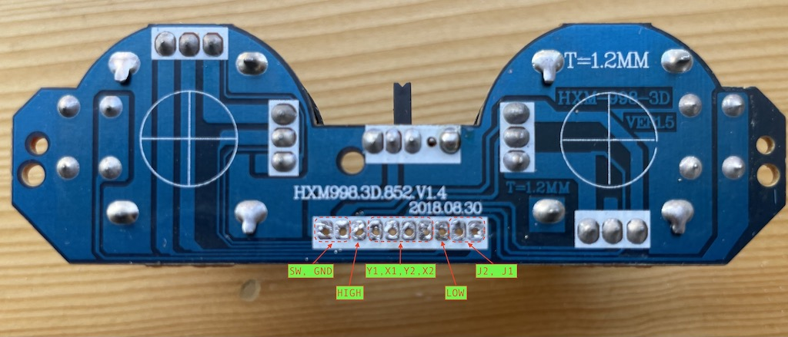

# Custom Remote Control

In addition to using an existing remote control, I also wanted to make my own remote control with joysticks. The biggest challenge is probably 3d pringing the housing. So I am exploring the option of using an existing wireless PS2 control bought on AliExpress, gutting the insides and replacing it with a microcontroller and adding a IR LED.

To do that, there are a few things I need to figure out.

1. The joysticks. A PS2 controller has two of them. They are both 2-axis joysticks. I assume they are resistive (i.e. pototiometers) and I should be able to use an ADC pin to read the position of an axis.
1. The IR emitter. This should be relatively easy. The library I use on the receiver side is also capable of sending.
1. The microcontroller. The PS2 controller is powered by 2 AAA batteries, I want to be able to reuse the power source. So I need an mcu that can be powered at 3V. First thing that came to my mind is ATmega 328. I have a couple of them and they are 8MHz versions.

## Microcontroller
As mentioned before, I intend to use an 8MHz ATmega328 devboard (Arduino Pro Mini clones), which should be able to run at 3V comofortably. So I am going to prototype everything on that board. One small caveat about working with this board is that ATmega328 comes in two versions: 8Mhz and 16MHz. When programming with Arduino IDE or CLI, we need to choose the correct frequency. Otherwise, the code will still run, but the timing is all messed up. Anything that relies on the frequency will not work properly. E.g. the serial console or the IR transmitter.

## IR transmitter
I have some generic 940 nm IR LEDs from Amazon and I intend to use one. These LEDs are rather finicky and direction sensitive. The GPIO pins have enough juice to drive them. But I want to improve the range a little. So I am planning to use a BJT to improve the range, which still doesn't seem to be great after some prototyping. But for a toy project like this, that's OK. I also tried using a MOSFET like 2N7000. I measured the current running through the LED. With the MOSFET, it's quite a bit smaller than with a BJT. So I'll stick with the BJT. As a future improvement, I am planning on using 433 MHz radio frequency transmission, which doesn't require a line of sight. But that's for another day. For now, let's focus on the IR transmission.

My first step is to make sure the MCU and the IR transmitter are capable of running on a 3V DC power supply. So I loaded up a simple sketch to send a code every half a second:

```
#include <IRremote.hpp>

void setup() {
  IrSender.begin(9);
}

void loop() {
  IrSender.sendNECRaw(0x2A);
  delay(500);
}
```

On the receiver side, I read the code from an IR receiver and dump the code:

```
#include <IRremote.hpp>

void setup() {
  Serial.begin(115200);
  IrReceiver.begin(3, false);
}

void loop() {
  if (IrReceiver.decode()) {
    uint32_t code = IrReceiver.decodedIRData.decodedRawData;
    decode_type_t protocol = IrReceiver.decodedIRData.protocol;
    Serial.print("Protocol: ");
    Serial.println(protocol);
    Serial.print("Code: ");
    Serial.println(code);
    IrReceiver.resume();
  }
}
```

Note that `sendNECRaw()` sends codes that are recognized as either protocol `9(NEC2)` or protocol `10(ONKYO)`. I suppose these two protocols are more or less the same and cannot be distinguished from the receiver side. The raw code is 32 bits, which is more than enough to encode joystick positions and key presses.


### Power saving
The MCU itself can be powered by 1.8-5.5V DC. And since I'm using batteries, I don't need the regulator. Removing it will increase the battery life and eliminate the voltage drop. I connect the battery power directly to the `Vcc` pin. The power indicator LED can be removed too.

## Controller Wiring

I got a couple of different wireless gamepad controllers from AliExpress and disassembled them. They both have tow major PCBs. PCB1, the main PCB, contains the battery box, the IC and various buttons. PCB2 contains two joysticks and a switch. Long story short, this particular one's main PCB has everything I need and needs minimum modification. However, it turned out its joysticks are digital, not analog. On the other hand, the other contoller's joysticks are analog and the PCB has the same dimentions. So I created a Frankenstein controller from both of them.

PCB1 contains:
* Left thumb: `L`, `R`, `U`, `D`
* Right thumb: `A`, `B`, `X`, `Y`
* Left index finger: `L1` & `L2`
* Right index finger: `R1` & `R2`
* Middle section: `Select`, `Mode`, `Start`
* A main IC, a transmission IC, and some passive components

I have no use for the components. So let's heat up the PCB with a heat gun and remove everything. I suspected all those buttons would be connected to the main IC in some way, forming a matrix. So I traced the PCB traces and determined the following connections.

|           | col 1 | col 2 | col 3 | col 4 | col 5 | col 6 | col 7 | col 8 |
|-----------|-------|-------|-------|-------|-------|-------|-------|-------|
| **row 1** |  `R1` |  `R2` |  `L1` |  `R2` | `SEL` |`MODE` |       |`START`|
| **row 2** |  `A`  |  `X`  |  `B`  |  `Y`  |  `D`  |  `U`  |  `R`  |  `L`  |

And the pins for the rows and columns:  
```
row 1: pin06  
row 2: pin07  
col 1: pin04  
col 2: pin09  
col 3: pin10  
col 4: pin11  
col 5: pin13  
col 6: pin14  
col 7: pin15  
col 8: pin16  
```


We will need these outgoing wires: 
* to PCB2: `BAT-`, `GND`
* to MCU: `BAT+`, `GND`, `Rows 1-2`, `Cols 1-8`

I did bridged a couple of pads on the PCB so that all wires except `BAT+` can go out from the holes in the center.

PCB2 contains:
* Joystick 1, with axes `X1`, `Y1`, and button `J1`
* Joystick 2, with axes `X2`, `Y2`, and button `J2`
* A sliding switch `SW`

When turned on, the switch shorts its pin to `GND`. The two buttons also shorts their pins to `GND` when pressed. The joysticks are analog. Each axis is a potentiometer. It has a high and a low inputs. The output is the wiper. I'll short the low to `GND` and connect the high to a GPIO.



Here's the plan for connections:
* Short `LOW` with `GND`
* Connect `SW` to `BAT-` from PCB1
* Connect `GND` to `GND` from PCB1, which ultimately connects to `GND` of the MCU

This way, when the switch is turned on, `BAT-` is connected to `GND` of both PCBs and the MCU. 

Outgoing wires:
* to PCB1: `BAT-`, `GND`
* to MCU: `HIGH`, `X1`, `Y1`, `X2`, `Y2`, `J1`, `J2`

For the analog joysticks, we feed a high to `HIGH`, and read the positions from `X1`, `Y1`, `X2`, `Y2`. I could connect `HIGH` to `Vcc`. But I want to pull it high only when I'm reading the values. This will save a little battery, at the cost of using an extra pin. Now to tally all the GPIO pin usage, we need to use 17 input pins, 4 of which need to be able to analog. Note that `A6` and `A7` are analog input only for Pro Mini. So I'll use them for a joystick. Pin `13` is the built-in LED. I could remove the LED and reclaim the pin. But I might find a use for it later. So I'm saving pin `13`. We also need one digital output pin to drive the IR LED. That's 18 GPIO pins in total. The dev board I have, basically a clone of Arduino Pro Mini, has just enough.

PCB1 ↔ MCU:
* `BAT+` ↔ `Vcc`
* `GND` ↔ `GND`
* `Rows 1-2` ↔ `11`, `12`
* `Cols 1-8` ↔ `2` - `9`

PCB2 ↔ MCU:
* `HIGH`: `A5`
* `X1`, `Y1`, `X2`, `Y2` ↔ `A2`, `A3`, `A6`, `A7`
* `J1`, `J2` ↔ `A0`, `A1`

And,
* IR LED: `10`. I want to solder the BJT directly to the dev board. Pin `10` is conveniently close to a ground pin. So I can solder two pins of the BJT on the board.


After some soldering and hot gluing, here are the PCBs with outgoing wires.


And after some drilling and cutting, I've placed the IR LED on the shell, with the resistor soldered to it and `BAT+`.


Next, let's solder the wires and the transistor to the dev board.


And voila! We have a custom remote control. After playing with it a little bit, I realized that without a power indicator, it's easy to forget to turn it off. Next time, I'll leave the power LED on the PCB.


## Control Protocol
I'm using [`sendNECRaw()`](https://github.com/Arduino-IRremote/Arduino-IRremote/blob/fbebc03a4c64a5b158be946eddf5835eedecf1c8/src/ir_NEC.hpp#L230) which can send a raw code of 32 bits at a time, which should be more than enough for a low speed application. I am sending one event in each transmission. The event can be a button push or a joystick position change. Here's the format of the packets.

* Byte 1 (highest 8 bits): type of packet
  - 1: Button push
  - 2: Joystick 1
  - 3: Joystick 2
* Byte 2: reserved
* Bytes 3 and 4: dependent on the type of packet
  - 1: Button code
  - 2 & 3: these two bytes contain the X and Y coordinates. Each coordinate is a unsigned 8 bit integer. This gives us the range of [0 - 255] for either axis.

## Control Treads with a Joystick
Wall-E's movements are controlled by two treads, just like a tank or a bulldozer. The left and right treads can move independently. And I want to use a joystick to control its movements. Since a 2-axis joystick has 2 degrees of freedom, just like the treads, it should be possible to map the joystick positions to the tread movements precisely. And I want the mapping to be intuitive as well. It turned out that this isn't super trivial. So I am going to elaborate a little in this section.

Let's denotes the movements of the two treads first. They can move forward or backwards. Let's use 1 to denote a full speed forward move, -1 for a full speed backward move, and 0 for no movements. So, for Wall-E to move forward full speed, we need a (1,1); a full speed backward movement can be achieved by a (-1,-1). To spin in place left, we need a (-1,-1); to make a left turn pivoting on the left tread, we need a (0,1), etc etc.

Now consider the movements of the joystick. When the joystick is in the neutral position, there should be no movements. We want the control to be intuitive. So, pushing the joystck forward and backward along the Y-axis should make Wall-E to move along a straight line and the direction and speed are dependent on the joystick's position relative to the neaural position. Similarly, when the joystick moves along the X-axis, we should be spinning in place. When the joystick is in the upper-left corner, we should be making a left turn pivoting on the left tread. And so on and so forth.

Now, we can plot the nine key positions and the tread values. And we can draw arrows to represent the joystick movements from one position to another and the trends of the tread values along the way. And we will represent the position of the joystick with a normalized 2-dimensional coordiate. `(-1,1)*(-1,1)`.

```
            l-               l=
 (0,1)    ←────    (1,1)    ────→    (1,0)
            r=               r-
    ↑                ↑                 ↑
  l+│r=            l+│r+             l=│r+
    │                │                 │    
            l-               l+
(-1,1)    ←────    (0,0)    ────→    (1,-1)
            r+               r-
    │                │                 │
  l=│r-            l-│r-             l-│r=    
    ↓                ↓                 ↓
            l=               l+
(-1,0)    ←────   (-1,-1)   ────→    (0,-1)
            r+               r=
```

Then we can interpolate all the positions in between. Ideally, the range of motion of the joystick would be a circle. But a square will also do. The logic is going to be slightly more complicated. The following formula satisfies all the key positions and tread lines.

```
if (sign(x) == sign(y)) {
  l = sign(y)*max(|x|,|y|);
  r = sign(y)*(|y|-|x|);
} else {
  r = sign(y)*max(|x|,|y|);
  l = sign(y)*(|y|-|x|);
}
```

## Control Arms with a Joystick
I want to use the second joystick to control the arms' movements. Since the arms have two degrees of freedom between them, and the joystick has two axes, we should be able to do that. The problem is to find an intuitive way. Here are my goals:

* Forward/backward: raise or lower both arms
* Backward: lower both arms
* Front left/back left: raise or lower left arm only
* Front right/back right: raise or lower right arm only

The remote control sends the raw positon of the joystick, just like the one that controls the treads. On the receiver (Wall-E) end, here's the logic.

* Determine if the joystick is to the left or right or in the middle, using the offset of the X axis.
* Raise or lower one or both arms depending on the previous result.
* The amount to raise or lower is determined by the offset of the Y axis.
